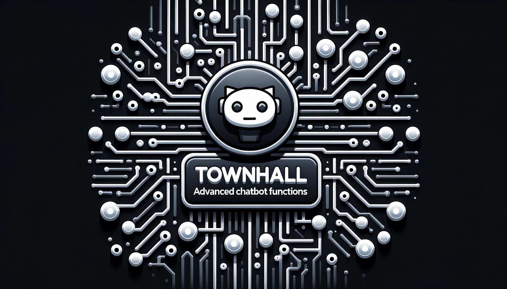

# Townhall

🚧 Under heavy development and in transition from a previous personal project. Not ready for production use. 🚧

[]()
[]()
[]()
[]()
[]()
[]()
[]()
[]()
[](https://github.com/PyCQA/bandit)

Townhall is a cutting-edge chatbot framework crafted in Python and grounded on the robust Autogen foundation. This isn't just another chatbot; Townhall leverages the power of advanced agents to breathe life into conversations and elevate them to a whole new level.

### 🧱 The Autogen Foundation: The Bedrock of Innovation
At its core, Townhall is built upon the Autogen framework, a pioneering platform for LLMs. Autogen enables the creation of agents that are not only customizable but also conversational. These agents can interact with each other, and seamlessly incorporate human inputs, setting the stage for more dynamic and intelligent dialogues.

### 🎼 Advanced Agents: The Symphony Conductors with Function Orchestration
Our advanced agents go beyond merely responding to user queries; they orchestrate multiple functions to provide a cohesive and engaging user experience. Think of them as the conductors of a grand symphony, where each instrument is a unique function or feature. They coordinate these functions to create a harmonious and effective dialogue, far outclassing traditional chatbots which often feel like disjointed sets of scripted responses.
The advanced agents adapt and learn, making each conversation better than the last. They can switch between various modes, employing a blend of LLMs, human inputs, and specialized tools to deliver a personalized conversational experience.

## Table of Contents

1. [Features](#features)
2. [Prerequisites](#prerequisites)
3. [Installation](#installation)
4. [Usage](#usage)
5. [Contributing](#contributing)
6. [Testing](#testing)
7. [Roadmap](#roadmap)
8. [Credits](#credits)
9. [License](#license)

## 🌟 Features

- **Planner**: The [planner](https://github.com/shoutsid/townhall/blob/main/app/agents/planner.py) initiate chats with the planner, and manage a registry of functions.
- **Function Registry**: The [function registry](https://github.com/shoutsid/townhall/blob/main/app/helpers/function_registry.py) module manages a registry of functions, allowing users to add, execute, and list functions.
- **Buddy**: The [buddy](https://github.com/shoutsid/townhall/blob/main/app/agents/buddy.py) module represents a chatbot that can initiate a chat between a user and an assistant agent.
- **Settings**: The [settings](https://github.com/shoutsid/townhall/blob/main/app/settings.py) module loads environment variables and defines configurations for the application.
- **User Agent**: The [user agent](https://github.com/shoutsid/townhall/blob/main/app/agents/user_agent.py) represents a user in the system and can send messages to other agents.
- **Chat Service**: The [chat service](https://github.com/shoutsid/townhall/blob/main/app/services/chat_service.py) module handles the logic for initiating and managing chats between agents.
- **Function Service**: The [function service](https://github.com/shoutsid/townhall/blob/main/app/services/function_service.py) module provides functionalities for executing specific tasks.
- **Planner Service**: The [planner service](https://github.com/shoutsid/townhall/blob/main/app/services/planner_service.py) module aids in planning and sequencing tasks for the chatbot.

## 📝 Prerequisites

Before you begin, ensure you have met the following requirements:

- Python 3.8 or higher
- pip package manager

## 🛠️ Installation

The easiest way to start playing is click below to use the Github Codespace.

[](https://codespaces.new/shoutsid/townhall?quickstart=1)

### For Linux/Mac

```bash
git clone https://github.com/shoutsid/townhall.git
cd townhall
pip install -r requirements.txt
```

### For Windows

```bash
git clone https://github.com/shoutsid/townhall.git
cd townhall
pip install -r requirements.txt
```

## 🌐 Usage

To start the chatbot, run the following command:

```bash
python main.py
```

For more advanced usage, refer to the [documentation (todo)](#).

## 🤝 Contributing

If you would like to contribute to Townhall, please fork the repository and use a feature branch. Pull requests are warmly welcome.

## 🧪 Testing

To run the tests:

```bash
pytest
```

## 🗺️ Roadmap

For the detailed roadmap of upcoming features, please visit our [Project Board](https://github.com/users/shoutsid/projects/1).

## 👏 Credits

- **Prompt Contributions**: A big thank you to [Josh-XT](https://github.com/Josh-XT) for the various prompts. Check out his repository [AGiXT](https://github.com/Josh-XT/AGiXT) for more details.

- **Autogen Foundation**: Townhall is built upon the robust [Autogen Framework](https://github.com/microsoft/autogen/), a pioneering platform for LLMs by Microsoft.

- **OpenAI Assistant**: Special mention to [OpenAI Assistant](https://chat.openai.com/) for aiding in the development process.

Developed by @shoutsid.


## 📜 License

This project is licensed under the GNU GENERAL PUBLIC LICENSE . See the [LICENSE.md](LICENSE.md) file for details.